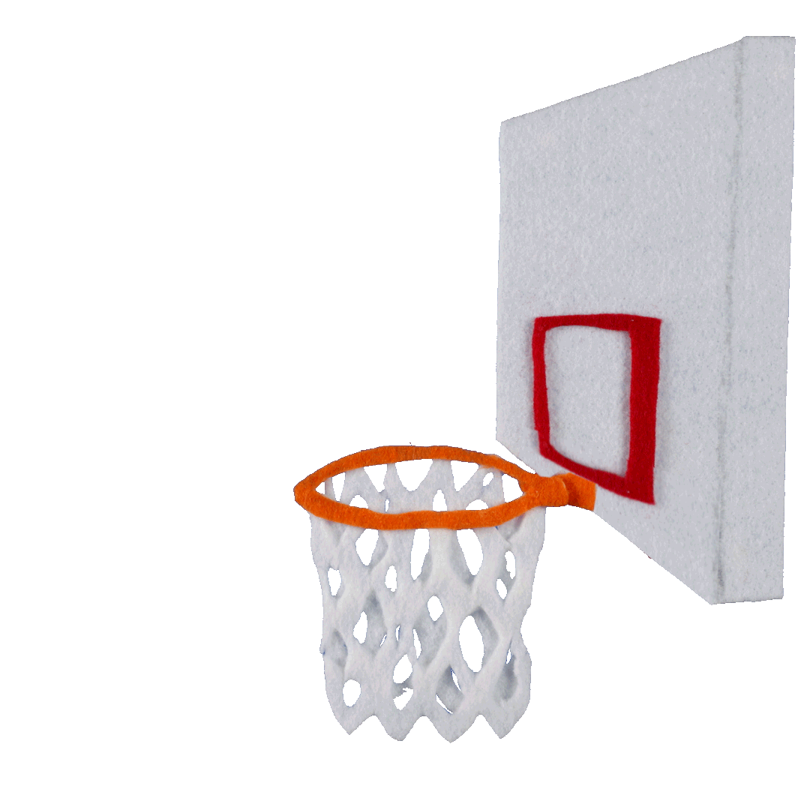
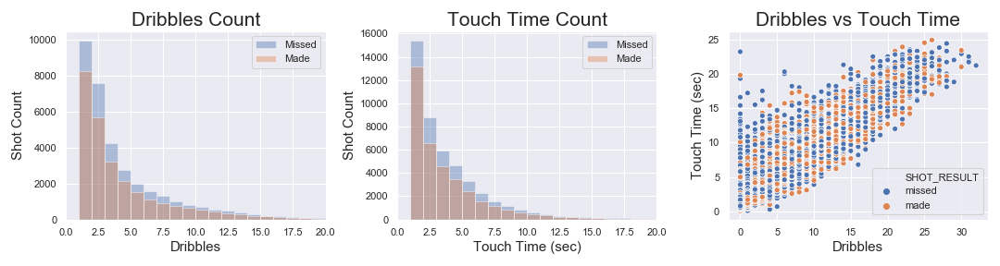
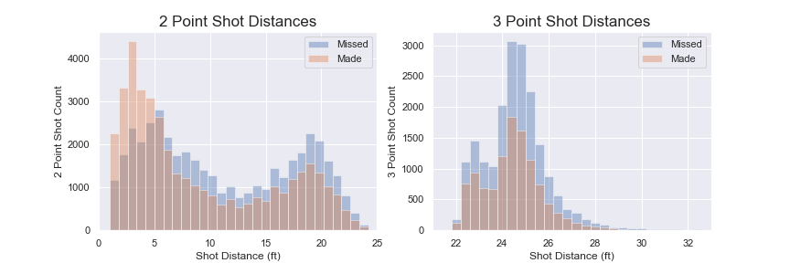
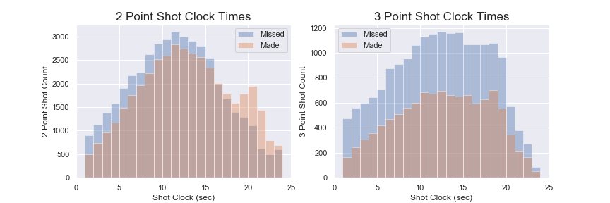
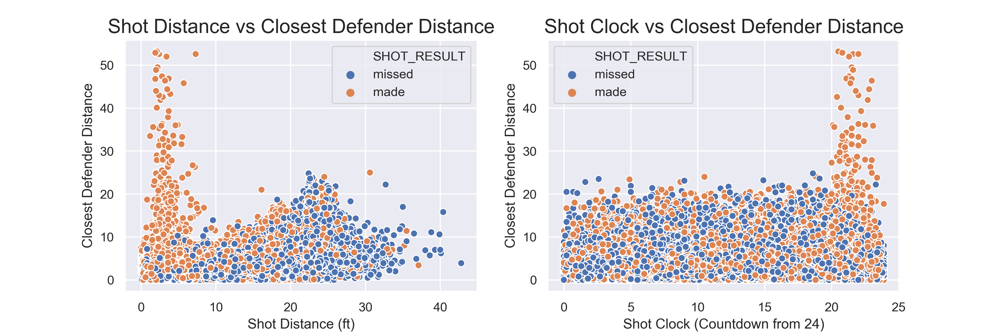
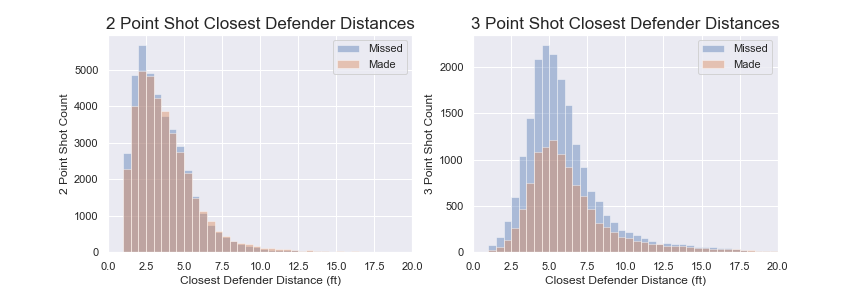
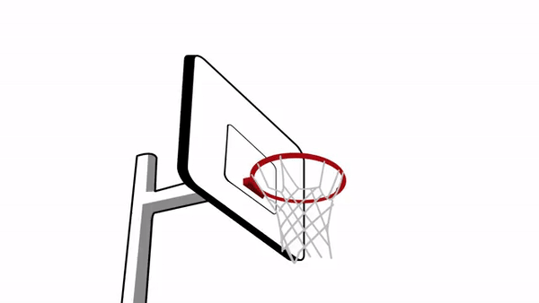

# NBA Shots Analysis: Can defense cause bricks?
**Ray Zhao**

### Table of Contents

* [Project Description](#description)
* [Data](#data)
* [Analysis](#analysis)
* [Plots](#plots)
* [Hypothesis Testing](#testing)
* [Conclusion](#conclusion)

## Project Description

In the 2014-15 NBA Season, there were many shots taken throughout the various games. Looking at specifically the 2 point and 3 point shots taken throughout the season, some shots were swishes (made shots) while others were bricks (missed shots). The goal for basketball is to win by making more shots and scoring more points than your opponent. The two biggest aspects of basketball are offense and defense, offense being the points your team scores and defense being the capability of stopping the opposing team from scoring. What characteristics of the shots affected their outcome, how can a player best set themselves up for a made shot rather than a miss? In the 2014-15 NBA season, let’s see if there was a difference in the distance of the closest defender in made and missed shots.

## Data

#### Source:
* Original CSV dataset obtained from [Kaggle](https://www.kaggle.com/dansbecker/nba-shot-logs). 
* Dataset consists of details on all shots taken in the 2014-15 NBA regular season from October to March.

#### Pipeline:
* Dataset imported using Pandas CSV read.
* Removed rows containing missing information i.e. null values.
* Removed unnecessary features
* Checked for inconsistencies in data then removed records containing those values e.g.,
    * Negative values for touch time (seconds the ball is held before a shot)
    * Incorrectly recorded 2 and 3 point shots (where shot distance did not match point type)
* Converted game clock string into total seconds passed

#### Cleaned Data:
* Dataset contains 115,235 rows and 15 features

| Features Name    | Description                                                           | Datatype |
|:-----------------|:----------------------------------------------------------------------|----------|
| Game ID          | Unique 8 digit number assigned to each individual game                | int      |
| Shot Number      | The number of the shot the player as taken in that game               | int      |
| Period           | The period of the game, there are 4 Quarters (1-4) and Overtimes      | int      |
| Game Clock       | Total seconds that pass since the start of the game                   | int      |
| Shot Clock       | Time on the shot clock when the shot is taken (counts down from 24.0) | float    |
| Dribbles         | Number of dribbles before the shot                                    | int      |
| Touch Time       | Time in seconds that the ball is held before the shot                 | float    |
| Shot Distance    | Distance of the shot in feet                                          | float    |
| Close Def Dist   | Distance of the closest defender in feet                              | float    |
| Pts Type         | 2 point or 3 point shot                                               | int      |
| Shot Result      | The shot is 'made' or 'missed'                                        | string   |
| FGM              | Binary version of 'Shot Result', 1 for 'made' and 0 for 'missed'      | int      |
| PTS              | Points resulting from the shot, dependent on Pts Type and FGM         | int      |
| Closest Defender | Name of the closest defender                                          | string   |
| Player Name      | Name of the player that took the shot                                 | string   |

## Analysis

### Exploratory Data Analysis

In this dataset, there are 896 unique games with data on shots taken from 281 players. Of the total 115,235 shots, 73.7% are 2 point shots while 26.3% are 3 point shots showing how in the 2014-15 NBA season 2 point shots were the majority of shots taken.

|                  | Total Shots   |   2 Point Shots   |  3 Point Shots |
|:-----------------|:-------------:|:-----------------:|:--------------:|
| Count            | 115,235       | 84,877            | 30,358         |
| % Made           | 44.3          | 48.6              | 36.1           |
| % Missed         | 53.4          | 51.4              | 63.9           |
| Most Taken By    | James Harden  | Lamarcus Aldrigde | Stephen Curry  |
| Most Made By     | Stephen Curry | Nikola Vucevic    | Stephen Curry  |
| Most Missed By   | James Harden  | Lamarcus Aldridge | Damian Lillard |
| Most Defended By | Pau Gasol     | Pau Gasol         | Chris Paul     |

**Fun Facts:**
* Most Taken/Made Shots with the shot clock under 4 seconds: Lebron James
* Most Shots Taken in One Game: Russell Westbrook with 37 shots
* Most Dribbles before a shot: Mo Williams with 32 dribbles
* Highest Shot Making Percentage (FG%): Deandre Jordan with 72.8%
* “Best/Worse Defender”: Most Occurences of being 4 ft away from the shot
    * Most defended shots resulting in a missed shot: Draymond Green
    * Most defended shots resulting in a made shot: Paul Millsap

## Plots

#### Comparing the Number of Dribbles Against Time the Ball is Held:

 

The number of dribbles and the amount of time a player touches the ball before a shot are both key factors in scoring the basketball. Players will use dribbles to try to get around their defenders or to create space for a better opportunity for a shot. As one can see in the histograms above, players do not hold and dribble the ball for too long before passing. Most of the time, if a player has the ball they will dribble leading to a linear relationship between dribbles and touch time. According to the scatterplot, neither dribbles or touch time affect the shot outcome. There are a few points where the ball is held for a long time with a low number of dribbles caused by situations where the player purposely runs down the shot clock for the last shot of a period which are often the more difficult leading to more missed shots.  

#### Number of 2 and 3 Point Shots Taken at All Distances:

 

2 point shots comprise the majority of the shots taken because they are easier to make since they are closer in shot distance. The shots taken in the 0-5 ft distance is the only area where there are more made shots than missed. Players will often try to take the closest shot possible but sometimes that isn't possible leading to them to take the "midrange shot". The midrange shot the second peak ranging from 15-20 ft.

3 point shots are shots taken from a longer distance. The 3 point line on a NBA basketball court is a semicircle with the basket in the middle of the flat side, [NBA court image](https://cdn.britannica.com/70/176970-004-4CBC795B.jpg). There are two set distances for a 3 point shot, the majority of the 3 point line is 23.75 ft away from the basket while the corners are flattened to be 22 ft away. This is why the 3 Point Shot Distances histogram is bimodal.  

#### Number of Shots Taken Throughout the Shot Clock:

 

The shot clock is a 24 second countdown where one team has possession of the ball and resets if the possession of the ball is changed. In the two histograms above, the distribution of 2 point and 3 point shots are shown over the course of the shot clock counting down. Both distributions are relatively normal leading one to believe that most of the time players take the shot halfway through the shot clock. That is common practice because they want to test the defense for a while to look for a good shot but they also don't want to run out of time. Although shooting the ball early on is not encouraged by coaches, players will shoot the ball whenever they are open which leads to the peak of made shots in the 2 Point Clock Times. Those opportunities are created from steals or fast breaks, the players will get a shot with no defenders close resulting in a high percentage shot early in the shot clock. Other times the defending team can cause enough pressure making a team to shoot the ball with the shot clock closer to 0.  

#### Shot Distance and Shot Clock Compared to Closest Defender Distance:

 

The biggest difference between a shot taken in a NBA game and practice shot is that there are defenders. In both scatter plots above, there is a large amount of made shots where the closest defender is far away caused by steals or fast breaks as mentioned previously. Disregarding the shots where the defender is really far, the shot distance appears to be an important factor in if the shot is made or missed while the made and missed shots are evenly distributed throughout the countdown of the shot clock. This information concurs with what was seen in the previous histograms. Still for when the closest defender distance is below 20 feet, it is hard to visualize if the distance of the defender impacts whether or not the shot is made.  

#### 2 and 3 Point Shots' Closest Defender Distances:

 

The two histograms above look at 2 and 3 point shots where the closest defender's distance was under 20 feet (removing 152 shots). For 2 point shots most of the time the defenders are within 4 ft of the shooter, while for 3 point shots the defenders are around 5 ft.
    
Looking at the 2 point shot count, it seems that the smaller the distance of the closest defender the more likely the shot is to be missed. As the closest defender's distance increases, the number of made 2 point shots in this datasets either come very close or even overtake the missed shots. On the other hand in the 3 point shot histogram, although the proportion of made to missed shots seems to look higher when the closest defender distance is lower, the same conclusion cannot be drawn as easily. To prove that for both 2 and 3 point shots, the closest defender distance for made shots is greater than for missed shots, two seperate Mann-Whitney signed rank tests will be run.  

## Hypothesis Testing

### The U-Tests for the 2 and 3 Point Shot Closest Defender Distance:

To test the hypothesis that the closest defender distance for a made 2 or 3 point shot is greater than for a missed shot, a Null hypothesis or skeptic stance was adopted for each test. The Null for the Mann–Whitney u-test is directly related to if a made or missed shot has a greater closest defender distance.  

**Null Hypothesis:** The distance of the closest defender for missed 2 or 3 point shots are equally likely to be higher than for made shots as the other way around, i.e. 
  
**P( Closest Defender Distance for Missed 2 > Closest Defender Distance for Made 2 ) = 0.5**  
**P( Closest Defender Distance for Missed 3 > Closest Defender Distance for Made 3 ) = 0.5**  
  
Assuming this null hypothesis is true, the rank-sum statistic assumes a known distribution (in this case a skewed normal distribution). The Mann-Whitney u-test compares the number of times a score from one sample is greater than the score from the second sample to determine ranks to test the null hypothesis.  

The sample sizes for these two tests is as followed (in the case the sample sizes are different, the Mann-Whitney u-test will match up the existing pairs):
| Sample                                            | Sample Size |
|---------------------------------------------------|:-----------:|
| Closest Defender Distance for Missed 2 (miss2CDD) |    43611    |
| Closest Defender Distance for Made 2 (made2CDD)   |    41174    |
| Closest Defender Distance for Missed 3 (miss3CDD) |    19352    |
| Closest Defender Distance for Made 3 (made3CDD)   |    10940    |

Using the scipy stats package, a Mann-Whitney u-test was run to find the p-values:  
`stats.mannwhitneyu(made2CDD, miss2CDD, alternative='greater')`  
`stats.mannwhitneyu(made3CDD, miss3CDD, alternative='greater')`  

| Null Hypothesis                                                                         |   p-value   |
|-----------------------------------------------------------------------------------------|:-----------:|
|P( Closest Defender Distance for Missed 2 > Closest Defender Distance for Made 2 ) = 0.5 |   4.2e-32   |
|P( Closest Defender Distance for Missed 3 > Closest Defender Distance for Made 3 ) = 0.5 |   5.2e-32   |

Both p-values 4.2e-32 and 5.2e-32 are statistically significant because they are below 0.05. The incredibly low p-values provide very strong evidence that null hypothesis should be rejected. Rejecting the null hypothesis conveys that for both 2 and 3 point shots, the closest defender distance a made shot is clearly greater than for a missed shot.

## Conclusion

In the 2014-15 NBA season leading up to March, the ratio of 2 and 3 point shots was about 3:1 which is no longer the case since the NBA is going through a 3 point revolution. The league average for a made 2 point shot is 48.6% which is 0.97 points per possession and 36.1% for a made 3 point shot which is 1.08 points per possession meaning that 3 point shots ultimately can result in more points per possession. Although 2 point shots will never disappear since it's shown that when the shot distance is low and the closest defender distance is far, the shot is made nearly every time.   

The closest defender distance for made shots was greater than for missed shots, meaning that if a defender gets lazy and doesn't stick with the player with the ball, the shot is more likely to be a swish.

**To continue with this topic:**

In regards to playing defense in basketball there is much more to analyze than just the distance of the closest defender. Although it may be more difficult to find other data on how a shooter is defended, there is also a lot to understand about what features of a shot lead to the best shot. Maybe after analyzing shot data, there is a way to determine a method to always make the shots taken look like the ones in the gif below. 

